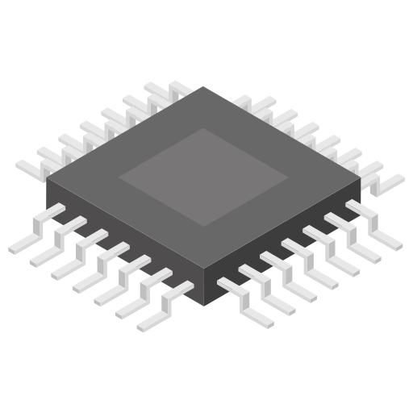
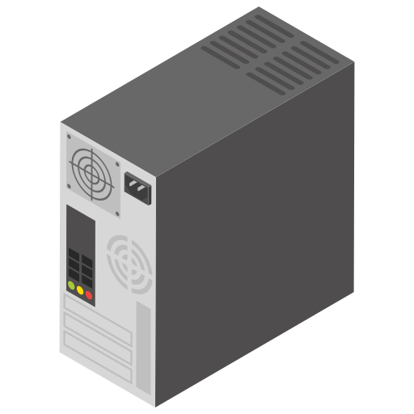

# DataRoot University: Data Science Fundamentals. Final project

Consists of:
* Feature Engineering & Data Preprocessing
* Model Selection, Training and Saving
* Creating a small Web API (as bonus)

Original dataset can be found here: https://www.kaggle.com/iliassekkaf/computerparts.

Simple classification of Intel CPUs' vertical segment (server, desktop, mobile, embedded) by given characteristics.






## Project structure

```
app
    ├── data                        - contains train and validation data
    │   ├── train.csv               - train set 
    │   └── val.csv                 - validation set (must contain target values)
    ├── models                      - this folder contains a trained estimator.
    │   └── <name>.pickle           - trained estimator. 
    │
    ├── settings                    - here you can store different constant values, connection parameters, etc.
    │   ├── constants.py            - multiple constants storage for their convenient usage.
    │   └── specifications.json     - specifications of your data preprocessing operations.   
    │   
    ├── utils                       - this folder contains instruments we'll use to work with dataset.
    │   ├── __init__.py             - init file for the package. 
    │   ├── dataloader.py           - dataloader. 
    │   ├── dataset.py              - class dedicated for giving info about the dataset.
    │   ├── predictor.py            - predictor.
    │   └── trainer.py              - train script.
    │ 
    ├── app.py                      - route, app.
    │
    ├── requirements.txt			- list of libraries used for Dockerization 
    │
    └── Dockerfile					- commands used for Dockerization
```
